# oled-gif-studio

<p align="center">
  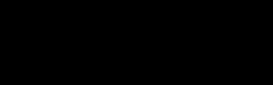
</p>

Générateur de GIFs animés **1 bit** pour les petits écrans OLED : claviers/souris
SteelSeries, modules SSD1306/SH1106 (Arduino, Raspberry Pi, macropads QMK)...

Pas de modèle IA, pas d'API payante : tout est **procédural** (Python + Pillow),
donc instantané, gratuit et pixel-perfect. Un mode « description en langage
naturel » (français ou anglais) choisit l'effet et les paramètres pour toi.

> Tous les aperçus de ce README sont agrandis ×3 — la taille réelle des GIFs
> est celle de l'écran cible (128×40 par défaut).

## Installation

Aucune, si Python (≥ 3.10) + Pillow sont déjà installés. Sinon :

```
pip install Pillow
```

Optionnel, pour avoir la commande `oledgif` partout :

```
pip install -e .
```

## Usage rapide

```powershell
# Depuis le dossier du projet :
python -m oledgif "HELLO WORLD"                          # effet auto → hello.gif
python -m oledgif "GG" -e slot -o gg.gif                 # machine à sous
python -m oledgif "PWNED" -e glitch -p rival             # pour l'OLED d'une souris
python -m oledgif "42" -e matrix --size 128x64 --fps 20  # taille custom

# En langage naturel :
python -m oledgif -d "le texte 'BONJOUR' défile lentement"
python -m oledgif -d "'GAME OVER' qui clignote vite pendant 3s"
python -m oledgif -d "un radar qui balaie l'écran"

# À partir d'une image :
python -m oledgif -i photo.jpg --fit cover               # photo plein écran, effet vhs
python -m oledgif -i comic.jpg --fit cover --style comic # illustration/BD
python -m oledgif -i logo.png -e bounce                  # le logo rebondit
python -m oledgif -i meme.gif                            # GIF animé converti tel quel

# Motifs sans texte (écrans de veille) :
python -m oledgif -e starfield
python -m oledgif -e plasma --seconds 6

# Un exemple de chaque effet dans ./samples :
python -m oledgif --demo
```

## Effets texte / image (`--list-effects`)

<table>
<tr>
<td align="center"><br><code>scroll</code> — défilement en boucle parfaite</td>
<td align="center">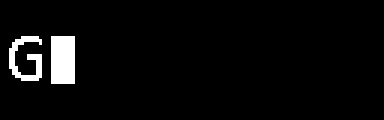<br><code>typewriter</code> — machine à écrire avec curseur</td>
</tr>
<tr>
<td align="center">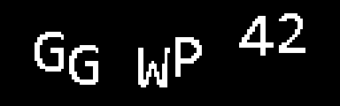<br><code>wave</code> — lettres en vague</td>
<td align="center">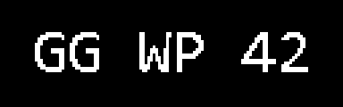<br><code>blink</code> — clignotement</td>
</tr>
<tr>
<td align="center">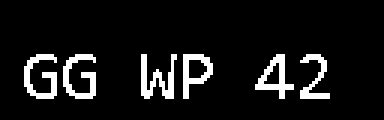<br><code>bounce</code> — rebond façon logo DVD</td>
<td align="center">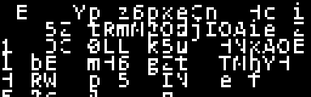<br><code>matrix</code> — pluie de caractères qui révèle le texte</td>
</tr>
<tr>
<td align="center">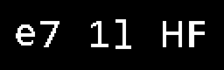<br><code>slot</code> — chaque lettre cycle puis se fige</td>
<td align="center"><br><code>glitch</code> — bandes décalées + bruit</td>
</tr>
<tr>
<td align="center">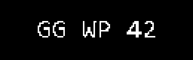<br><code>pulse</code> — battement de cœur</td>
<td align="center">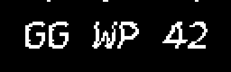<br><code>vhs</code> — tracking façon cassette vidéo</td>
</tr>
<tr>
<td align="center">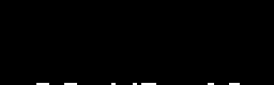<br><code>slide</code> — générique bas → haut</td>
<td></td>
</tr>
</table>

`typewriter`, `wave`, `matrix` et `slot` sont réservés au texte ; les autres
acceptent aussi une image (`--image`).

`--effect auto` (défaut) : `scroll` si le texte est trop large pour l'écran,
sinon `wave` ; `vhs` pour une image ; conversion directe pour un GIF animé.

## Motifs sans texte (écrans de veille)

<table>
<tr>
<td align="center">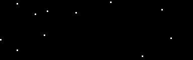<br><code>starfield</code> — hyperespace</td>
<td align="center">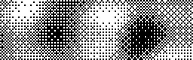<br><code>plasma</code> — plasma rétro tramé</td>
</tr>
<tr>
<td align="center">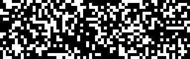<br><code>life</code> — jeu de la vie de Conway</td>
<td align="center">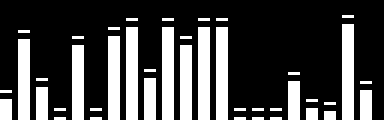<br><code>eq</code> — égaliseur audio</td>
</tr>
<tr>
<td align="center">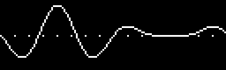<br><code>scope</code> — oscilloscope</td>
<td align="center">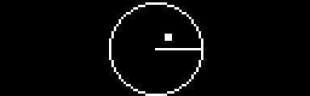<br><code>radar</code> — balayage avec échos</td>
</tr>
</table>

## Images : les 4 styles de rendu

Convertir une image couleur en 1 bit sur 5120 pixels est un exercice de
sacrifice — le bon `--style` dépend de la source. Démonstration sur la même
scène (lune, silhouettes sur ciel en dégradé, lumières de ville) :

| Rendu | Style |
|---|---|
| 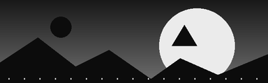 | **Source** (niveaux de gris) |
| 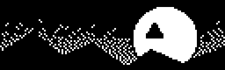 | `--style photo` (défaut) — auto-contraste + netteté + trame Floyd-Steinberg. Le bon choix pour les **photos réelles** : la trame simule les niveaux de gris. Sur une illustration, elle devient du bruit. |
| 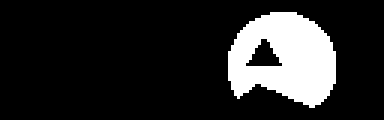 | `--style solid` — seuillage net (alias `--no-dither`). Parfait pour les **logos** et dessins au trait… mais tout ce qui est sombre-sur-sombre disparaît dans le noir. |
| 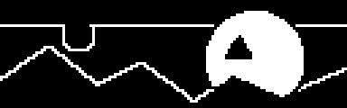 | `--style comic` — comme `solid`, mais un 2ᵉ seuil automatique (Otsu) sépare les tons sombres et retrace en **contour blanc** les formes noyées dans le noir. Idéal pour les **illustrations/BD**. |
| 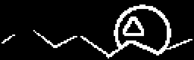 | `--style edges` — détection de contours, traits blancs sur fond noir. Look néon/filaire, souvent le plus lisible pour un **paysage ou un visage**. |

Autres options d'image :

- `--fit cover` — l'image remplit tout l'écran (recadrée) au lieu d'être
  réduite à un timbre-poste au milieu. Recommandé pour les photos paysage.
- **Dé-bruitage** (actif par défaut) : un filtre médian + une suppression des
  pixels isolés éliminent le « poivre et sel » (reflets, lampadaires, étoiles).
  `--no-denoise` le désactive si tu veux justement garder ces points.
- Un **GIF animé** en entrée est converti frame par frame en conservant les
  durées d'origine (avec `--effect auto`).

## Langage naturel (`--describe`)

```powershell
python -m oledgif -d "le texte 'BRB' qui rebondit pendant 5 secondes"
python -m oledgif -d "'REC' en mode vhs vintage"
python -m oledgif -d "a fast blinking 'GO' for 3 seconds"
```

Le parseur (FR/EN, insensible aux accents) reconnaît l'effet par mots-clés
(« défile », « clignote », « tape », « radar », « vintage »…), le texte entre
guillemets, la durée (« pendant 3s ») et la vitesse (« lentement », « vite »).

## Écrans préconfigurés (`--list-presets`)

| Preset        | Taille  | Matériel |
|---------------|---------|----------|
| `apex` (défaut) | 128×40 | SteelSeries Apex 5 / 7 / Pro (OLED clavier) |
| `rival`       | 128×36  | SteelSeries Rival 700 / 710 (OLED souris) |
| `oled-128x64` | 128×64  | SSD1306 / SH1106 / SSD1309 |
| `oled-128x32` | 128×32  | SSD1306 |
| `oled-96x16`  | 96×16   | SSD1306 |
| `oled-256x64` | 256×64  | SSD1322 |

N'importe quelle autre taille : `--size LARGEURxHAUTEUR`.

## Options utiles

- `--charset alnum|digits|upper|letters|ascii` ou une chaîne littérale — le
  jeu de caractères utilisé par `matrix` et `slot` (défaut : les 62
  alphanumériques `0-9A-Za-z`).
- `--font chemin.ttf --font-size N` — police custom (défaut : Consolas,
  taille ajustée à l'écran).
- `--invert` — noir sur blanc.
- `--scale 4` — GIF agrandi ×4 (pour prévisualiser confortablement).
- `--seed 42` — rendu reproductible pour les effets aléatoires.
- `--fps`, `--seconds`, `--speed` (px/s pour scroll).

## Envoyer le GIF sur l'écran SteelSeries

Deux options :

1. **SteelSeries GG** : dans les réglages de ton clavier (section OLED),
   tu peux importer une image/GIF 128×40 — les GIFs générés ici sont au bon
   format (1 bit, taille exacte).
2. **GameSense API** (programmatique) : comme le fait
   [SteelseriesAnimGif](https://github.com/bolner/SteelseriesAnimGif), on peut
   streamer les frames vers l'écran via l'API locale de SteelSeries GG.
   Les GIFs produits ici sont directement exploitables frame par frame.

## Structure du projet

```
oledgif/
  cli.py        # ligne de commande + make_gif()
  effects.py    # les 11 effets texte/image (registre @effect)
  patterns.py   # les 6 motifs sans texte
  render.py     # préparation d'images, binarisation, écriture GIF
  describe.py   # parseur langage naturel FR/EN
  presets.py    # tailles d'écrans du marché
  fonts.py      # chargement de police
samples/        # un GIF d'exemple par effet (taille réelle, --demo)
docs/           # illustrations du README (agrandies ×3)
```
